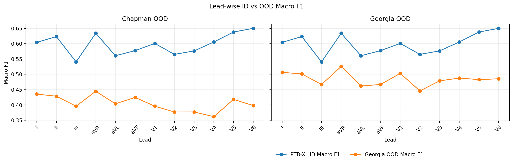
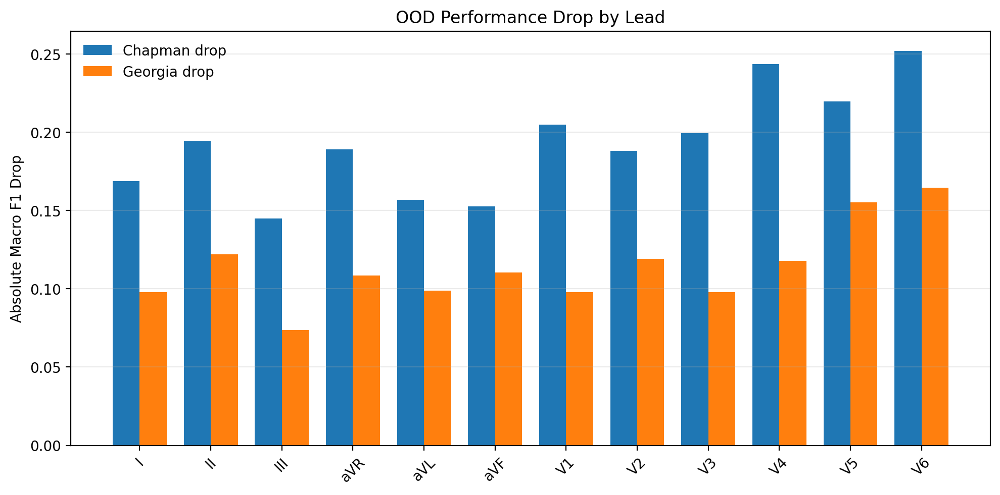
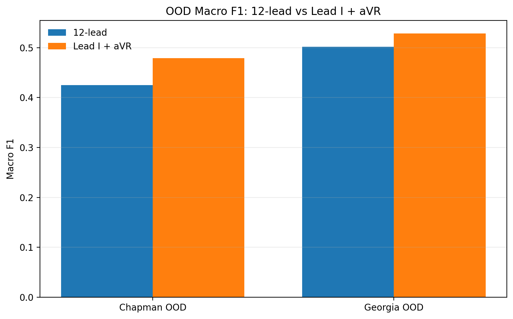

# Lead-Based OOD Effectiveness for ECG Arrhythmia Detection

This repository studies how ECG lead selection affects **out-of-distribution (OOD)** performance for multilabel arrhythmia detection.

We train lead-based models on PTB-XL (in-distribution) and evaluate generalization on external datasets (Chapman and Georgia). The core research question is:

**Can a small lead subset (especially Lead I + aVR) retain or improve OOD effectiveness compared with a 12-lead model?**

## Table of Contents
- [Research Summary](#research-summary)
- [Project Structure](#project-structure)
- [Setup](#setup)
- [Data Preparation](#data-preparation)
- [Training](#training)
- [Evaluation](#evaluation)
- [Results](#results)
- [Key Findings](#key-findings)
- [Scripts](#scripts)

## Research Summary
- Task: multilabel arrhythmia classification (`NORM`, `MI`, `STTC`, `CD`, `HYP`)
- In-distribution (ID): PTB-XL
- OOD test sets: Chapman, Georgia
- Comparison axes:
  - 12-lead model vs lead-based models
  - Lead-wise OOD drop from PTB-XL ID performance
  - Focused 2-lead setup: `Lead I + aVR`

## Project Structure
```text
D:/ad/
|- train12lead.py
|- leadtrain.py
|- eval12.py
|- evalleadbased.py
|- eval_avr_lead1.py
|- best2leads.py
|- models/
|- lead_based_models/
|- data/
|- results/
|  |- chapman_ood_comparison.csv
|  |- chapman_ood_comparison.json
|  |- georgia_ood_comparison.csv
|  |- georgia_ood_comparison.json
|  |- results_12lead_chapman.json
|  |- results_12lead_georgia.json
|  |- results_aVR_LeadI_chapman.json
|  |- results_aVR_LeadI_georgia.json
|  |- leadwise_id_vs_ood_macro_f1.png
|  |- leadwise_ood_drop.png
|  '- model_setting_comparison.png
'- README.md
```

## Setup
```bash
pip install torch scikit-learn pandas numpy tqdm wfdb matplotlib
```

## Data Preparation
Place datasets and preprocessed arrays under:
- `data/chapman/`
- `data/georgia/`

Expected files include ECG arrays and labels (for example `X_*.npy`, `y_*.npy`) plus metadata/mapping CSVs used by the training and evaluation scripts.

## Training
12-lead baseline:
```bash
python train12lead.py
```

Lead-based models:
```bash
python leadtrain.py
```

## Evaluation
12-lead OOD evaluation:
```bash
python eval12.py chapman
python eval12.py georgia
```

Lead-based OOD evaluation and comparisons:
```bash
python evalleadbased.py
python best2leads.py
python eval_avr_lead1.py
```

## Results

### 1) 12-Lead OOD Performance

| Dataset | Macro F1 | Macro Precision | Macro Recall | Macro AUC | Hamming Loss | Subset Accuracy |
|---|---:|---:|---:|---:|---:|---:|
| Chapman | 0.4253 | 0.4120 | 0.6465 | 0.8226 | 0.2234 | 0.4403 |
| Georgia | 0.5020 | 0.5607 | 0.5515 | 0.7382 | 0.2958 | 0.2542 |

Source files:
- `results/results_12lead_chapman.json`
- `results/results_12lead_georgia.json`

### 2) Lead I + aVR OOD Performance

| Dataset | Macro F1 | Macro Precision | Macro Recall | Macro AUC | Hamming Loss | Subset Accuracy |
|---|---:|---:|---:|---:|---:|---:|
| Chapman | 0.4793 | 0.4462 | 0.6452 | 0.8479 | 0.1584 | 0.5763 |
| Georgia | 0.5285 | 0.5248 | 0.6032 | 0.7515 | 0.2757 | 0.2847 |

Source files:
- `results/results_aVR_LeadI_chapman.json`
- `results/results_aVR_LeadI_georgia.json`

### 3) Lead-wise OOD Drop (ID to OOD)

Average absolute macro-F1 drop across leads:
- Chapman: **0.1929**
- Georgia: **0.1136**

Best OOD leads (macro F1):
- Chapman: **aVR (0.4448)**, **I (0.4354)**, **II (0.4285)**
- Georgia: **aVR (0.5256)**, **I (0.5065)**, **V1 (0.5030)**

Largest OOD drops:
- Chapman: **V6 (0.2519)**, **V4 (0.2436)**, **V5 (0.2197)**
- Georgia: **V6 (0.1646)**, **V5 (0.1552)**, **II (0.1219)**

Source files:
- `results/chapman_ood_comparison.csv`
- `results/georgia_ood_comparison.csv`

### 4) Visualizations

#### Lead-wise ID vs OOD Macro F1


#### Lead-wise Absolute OOD Drop


#### 12-Lead vs Lead I + aVR


## Key Findings
1. OOD degradation is visible for every lead, but is substantially larger on Chapman than Georgia.
2. `aVR` and `Lead I` are consistently strong OOD leads across both datasets.
3. The 2-lead setting (`I + aVR`) outperforms the 12-lead baseline in these OOD runs:
   - Chapman: `0.4793` vs `0.4253` (Macro F1)
   - Georgia: `0.5285` vs `0.5020` (Macro F1)
4. `MI` remains the hardest class in OOD settings (low class-wise F1 across models), indicating persistent clinical sensitivity challenges.

## Scripts
- `train12lead.py`: train 12-lead model.
- `leadtrain.py`: train lead-based models.
- `eval12.py`: evaluate 12-lead models on target dataset.
- `evalleadbased.py`: evaluate lead-wise models and generate comparisons.
- `best2leads.py`: identify strongest lead pairs.
- `eval_avr_lead1.py`: focused evaluation of `Lead I + aVR`.
- `audit_chapman.py`, `audit_georgia.py`: label dictionary auditing utilities.

---
This README reflects the latest outputs in `D:/ad/results` and is aligned to the lead-based OOD effectiveness study objective.
